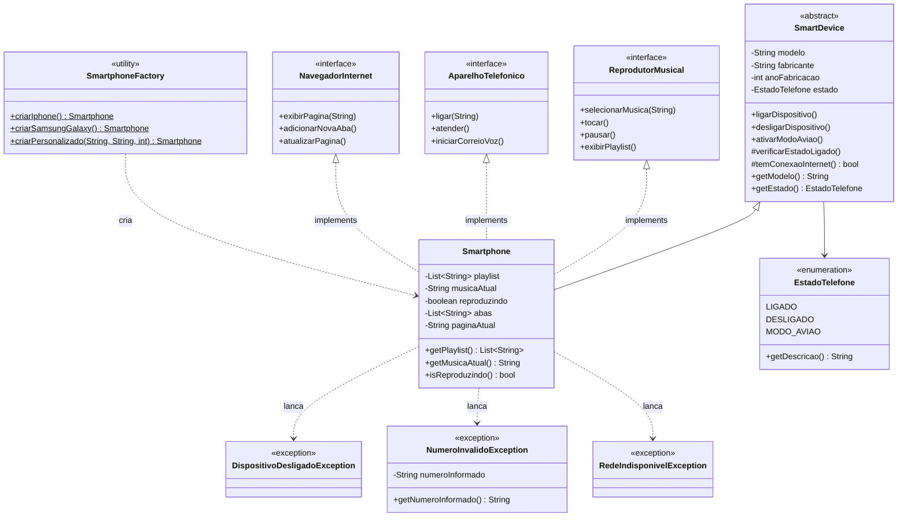

# Smartphone Simulator

> Simulação de um Smartphone moderno utilizando **Java 17+** e os pilares da **Programação Orientada a Objetos (POO)**.

---

## Sobre o Projeto

Este projeto simula os componentes de um dispositivo multifuncional moderno, separando responsabilidades por meio de **interfaces** e aplicando os princípios **SOLID**. O objetivo é demonstrar domínio em arquitetura orientada a objetos, tratamento de exceções, enums, padrão Factory e testes unitários com JUnit 5.

---

## Diagrama de Classes



---

## Conceitos Aplicados

| Pilar POO | Como foi aplicado |
|---|---|
| **Abstração** | `SmartDevice` define o contrato base; interfaces definem comportamentos modulares |
| **Encapsulamento** | Estado interno protegido com `private`; playlist exposta de forma imutável |
| **Herança** | `Smartphone` estende `SmartDevice` herdando gerenciamento de estado |
| **Polimorfismo** | `Smartphone` referenciado via `ReprodutorMusical`, `AparelhoTelefonico` e `NavegadorInternet` |

### Padrões e Boas Práticas

| Técnica | Aplicação |
|---|---|
| **Factory Method** | `SmartphoneFactory` centraliza a criação de instâncias |
| **SOLID — SRP** | Cada interface representa uma única responsabilidade |
| **SOLID — OCP** | Novas funcionalidades sem alterar código existente |
| **SOLID — LSP** | `Smartphone` substitui qualquer uma de suas interfaces |
| **Exceções customizadas** | `RedeIndisponivelException`, `NumeroInvalidoException`, `DispositivoDesligadoException` |
| **Java Enum** | `EstadoTelefone` com comportamento encapsulado (LIGADO, DESLIGADO, MODO_AVIAO) |
| **JavaDoc** | Toda API pública documentada |
| **Regex de validação** | Validação de número telefônico no método `ligar()` |

---

## Estrutura do Projeto

```
smartphone-simulator/
├── src/
│   ├── main/java/com/jorgeviictor/smartphone/
│   │   ├── interfaces/
│   │   │   ├── ReprodutorMusical.java       ← contrato do reprodutor
│   │   │   ├── AparelhoTelefonico.java      ← contrato do telefone
│   │   │   └── NavegadorInternet.java       ← contrato do navegador
│   │   ├── model/
│   │   │   ├── SmartDevice.java             ← classe abstrata base
│   │   │   ├── Smartphone.java              ← implementação principal
│   │   │   ├── EstadoTelefone.java          ← enum de estados
│   │   │   └── SmartphoneFactory.java       ← padrão Factory
│   │   ├── exceptions/
│   │   │   ├── DispositivoDesligadoException.java
│   │   │   ├── NumeroInvalidoException.java
│   │   │   └── RedeIndisponivelException.java
│   │   └── main/
│   │       └── Main.java                    ← demo com polimorfismo
│   └── test/java/com/jorgeviictor/smartphone/
│       └── model/
│           └── SmartphoneTest.java          ← JUnit 5 (30+ testes)
└── pom.xml
```

---

## Como Executar

### Pré-requisitos

- Java 17+
- Maven 3.8+

### Clone e execute

```bash
# Clone o repositório
git clone https://github.com/jorgeviictor/jorgeviictor.git
cd jorgeviictor/smartphone-simulator

# Compile e execute a demo principal
mvn compile exec:java

# Ou empacote e execute manualmente
mvn package -DskipTests
java -cp target/smartphone-simulator-1.0.0.jar com.jorgeviictor.smartphone.main.Main
```

### Rodando os testes

```bash
cd smartphone-simulator
mvn test
```

---

## Saída esperada

```
=======================================================
  SIMULADOR DE SMARTPHONE - Demo Principal
=======================================================
[iPhone 15 Pro] Dispositivo ligado com sucesso.
Dispositivo: Apple iPhone 15 Pro (2023) | Estado: Ligado

--- REPRODUTOR MUSICAL ---
[Reprodutor] Adicionada a playlist: "Bohemian Rhapsody - Queen"
[Reprodutor] Adicionada a playlist: "Stairway to Heaven - Led Zeppelin"
[Reprodutor] Adicionada a playlist: "Imagine - John Lennon"
[Reprodutor] === Playlist ===
  >> 1. Bohemian Rhapsody - Queen
     2. Stairway to Heaven - Led Zeppelin
     3. Imagine - John Lennon
[Reprodutor] >> Reproduzindo: "Bohemian Rhapsody - Queen"
[Reprodutor] || Pausado: "Bohemian Rhapsody - Queen"

--- APARELHO TELEFONICO ---
[Telefone] Ligando para: (11) 99999-8888...
[Telefone] Chamada atendida.
[Telefone] Correio de voz iniciado. Deixe sua mensagem apos o sinal...

[Teste] Tentando numero invalido...
[ERRO ESPERADO] Numero invalido... | Numero informado: "numero-errado"

--- NAVEGADOR DE INTERNET ---
[Navegador] Carregando pagina: https://github.com/jorgeviictor
[Navegador] Nova aba aberta. Total de abas: 1
[Navegador] Nova aba aberta. Total de abas: 2
[Navegador] Atualizando: https://github.com/jorgeviictor

--- TESTE: MODO AVIAO bloqueia rede ---
[iPhone 15 Pro] Modo Aviao ativado. Conectividade desabilitada.
[ERRO ESPERADO] Rede indisponivel. Verifique se o Modo Aviao esta desativado.

--- TESTE: Operacao com dispositivo desligado ---
[iPhone 15 Pro] Dispositivo desligado.
[ERRO ESPERADO] Operacao nao permitida: o dispositivo 'iPhone 15 Pro' esta desligado.
```

---

## Tecnologias

- **Java 17**
- **Maven 3.8+**
- **JUnit 5.10** — testes unitários com `@Nested`, `@ParameterizedTest` e `assertAll`
